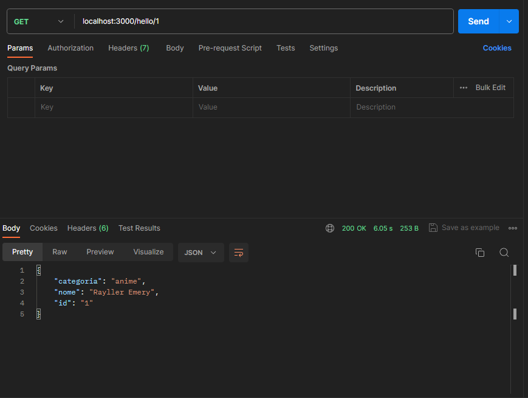
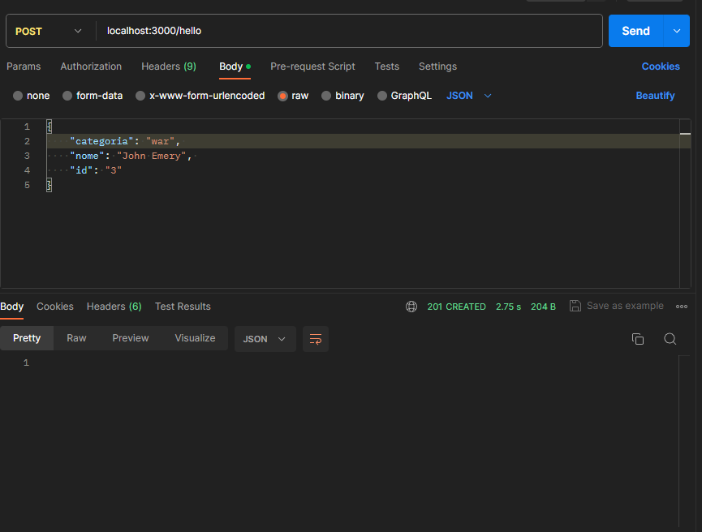

# dynamodb_lambda_java

The basically function of this project is exposing an endpoint with GET and POST methods, connect with a DynamoDB and make a read and write on a table.

This project contains source code and supporting files for a serverless application that you can deploy with the SAM CLI. It includes the following files and folders.

- HelloWorldFunction/src/main - Code for the application's Lambda function.
- events - Invocation events that you can use to invoke the function.
- HelloWorldFunction/src/test - Unit tests for the application code. 
- template.yaml - A template that defines the application's AWS resources.

The application uses several AWS resources, including Lambda functions and an API Gateway API. These resources are defined in the `template.yaml` file in this project. You can update the template to add AWS resources through the same deployment process that updates your application code.

You will need the following tools:

To use the SAM CLI, you need the following tools.

* SAM CLI - [Install the SAM CLI](https://docs.aws.amazon.com/serverless-application-model/latest/developerguide/serverless-sam-cli-install.html)
* java17 - [Install the Java 17](https://docs.aws.amazon.com/corretto/latest/corretto-17-ug/downloads-list.html)
* Maven - [Install Maven](https://maven.apache.org/install.html)
* Docker - [Install Docker community edition](https://hub.docker.com/search/?type=edition&offering=community)


If you prefer to use an integrated development environment (IDE) to build and test your application, you can use the AWS Toolkit.  
The AWS Toolkit is an open source plug-in for popular IDEs that uses the SAM CLI to build and deploy serverless applications on AWS. The AWS Toolkit also adds a simplified step-through debugging experience for Lambda function code. See the following links to get started.

* [CLion](https://docs.aws.amazon.com/toolkit-for-jetbrains/latest/userguide/welcome.html)
* [GoLand](https://docs.aws.amazon.com/toolkit-for-jetbrains/latest/userguide/welcome.html)
* [IntelliJ](https://docs.aws.amazon.com/toolkit-for-jetbrains/latest/userguide/welcome.html)
* [WebStorm](https://docs.aws.amazon.com/toolkit-for-jetbrains/latest/userguide/welcome.html)
* [Rider](https://docs.aws.amazon.com/toolkit-for-jetbrains/latest/userguide/welcome.html)
* [PhpStorm](https://docs.aws.amazon.com/toolkit-for-jetbrains/latest/userguide/welcome.html)
* [PyCharm](https://docs.aws.amazon.com/toolkit-for-jetbrains/latest/userguide/welcome.html)
* [RubyMine](https://docs.aws.amazon.com/toolkit-for-jetbrains/latest/userguide/welcome.html)
* [DataGrip](https://docs.aws.amazon.com/toolkit-for-jetbrains/latest/userguide/welcome.html)
* [VS Code](https://docs.aws.amazon.com/toolkit-for-vscode/latest/userguide/welcome.html)
* [Visual Studio](https://docs.aws.amazon.com/toolkit-for-visual-studio/latest/user-guide/welcome.html)

## Deploy the sample application

The Serverless Application Model Command Line Interface (SAM CLI) is an extension of the AWS CLI that adds functionality for building and testing Lambda applications. It uses Docker to run your functions in an Amazon Linux environment that matches Lambda. It can also emulate your application's build environment and API.

To use the SAM CLI, you need the following tools.

* SAM CLI - [Install the SAM CLI](https://docs.aws.amazon.com/serverless-application-model/latest/developerguide/serverless-sam-cli-install.html)
* java17 - [Install the Java 17](https://docs.aws.amazon.com/corretto/latest/corretto-17-ug/downloads-list.html)
* Maven - [Install Maven](https://maven.apache.org/install.html)
* Docker - [Install Docker community edition](https://hub.docker.com/search/?type=edition&offering=community)
* AWS CLI - [Install the AWS CLI](https://docs.aws.amazon.com/pt_br/cli/latest/userguide/getting-started-install.html)

## Build locally

Having the tools installed, you most have an aws profile configure on you machine, with access-key and secret-key and table created at DynamoDB. Or as alternative option, you can use LocalStack configured locally.

So, open the source code (App.java) and replace the variables with the values you needed: <br>
```
private static final String tableName = "tableName"
private static final String region = "us-east-1"
```

## Use the SAM CLI to build and test locally

Build your application with the `sam build` command.

```bash
dynamodb_lambda_java$ sam build
```

After app builded, run:

```bash
dynamodb_lambda_java$ sam local start-api
```

Your api gateway is up on port 3000 on localhost `localhost:3000/hello`. Now you can call the two method of `/hello` endpoint.

## GET Method


## POST Method


